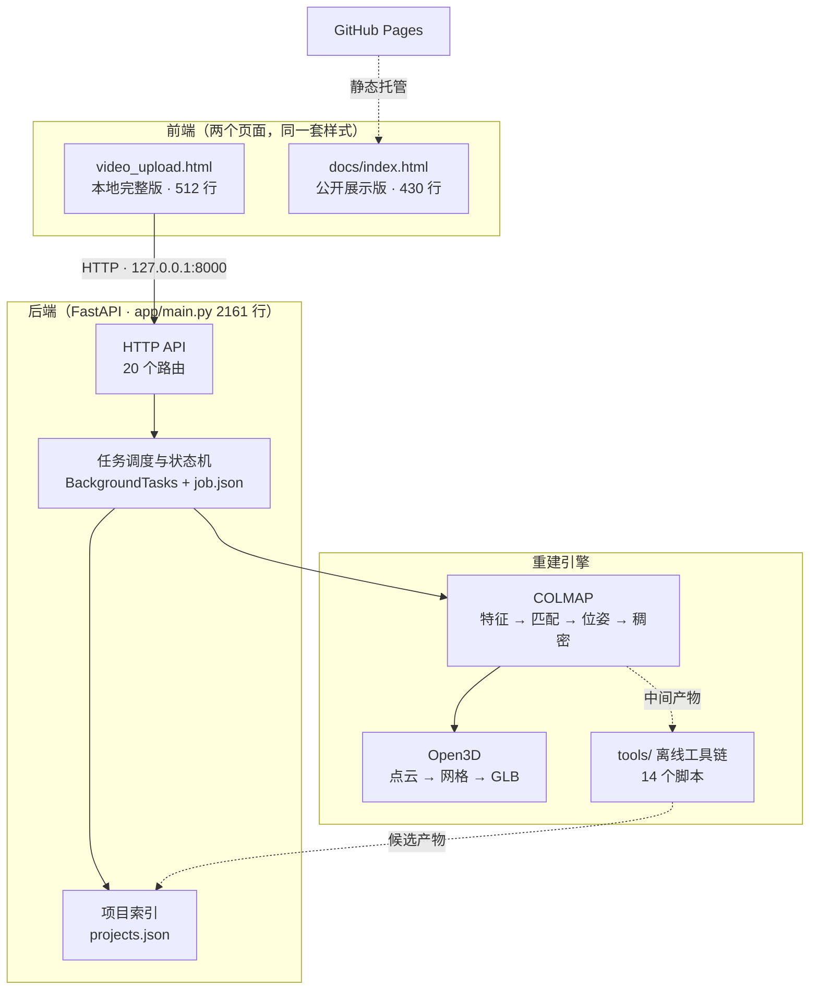
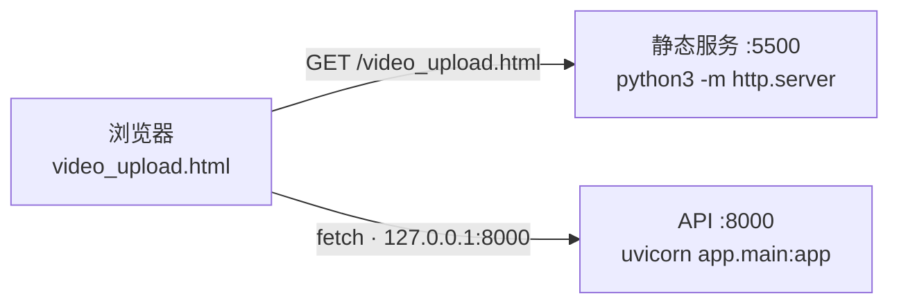

# 开发过程：前端与后端分述

> 这个项目做的事情可以压成一句话：**后端负责把一段环绕视频变成可信的三维模型，前端负责让人看清这个模型为什么可信。**
>
> 两者耦合很松 —— 后端是一个纯 HTTP API，前端是一个不依赖构建步骤的单页 HTML。下面把两侧分开讲，最后再讲它们怎么对接。

## 0. 全景



---

# 第一部分 · 后端

## 1.1 起点：为什么不能做成"上传就出模型"

第一版的想法很朴素：一个接口收视频、跑命令、返回 GLB。实际跑起来立刻撞上四个问题，后端的所有设计基本都是在回应它们：

| 问题 | 具体表现 | 后端的回应 |
| --- | --- | --- |
| 任务太长 | 稠密重建要几十分钟到数小时，HTTP 请求早就超时了 | 改成**异步任务**：接口立刻返回 `202 + job_id`，状态落盘到 `job.json`，前端轮询 |
| 任务会断 | 机器重启、显存被打满、手动中断 | **阶段化 + 可续跑**：每个阶段产物留在任务目录，重跑同一条命令会跳过已完成部分 |
| 进程会死 | `uvicorn` 重启时子进程被带走，或反过来 `colmap` 变成孤儿 | 启动脚本用 `setsid` 脱离会话；停止时显式回收子进程 |
| 产物不可信 | 自动算法会误伤真实特征，也可能输出方位错误的模型 | **候选制**：任何自动产物默认 `approved: false`，必须人工审核 |

最后一条是整个项目最重要的设计决定，它直接决定了前端长什么样（见 2.4）。

## 1.2 技术选型

| 选择 | 理由 |
| --- | --- |
| FastAPI + uvicorn | 需要 `BackgroundTasks` 跑长任务、需要 Pydantic 做请求校验、需要 `FileResponse` 直接吐 GLB；三者都是内置能力 |
| `pydantic-settings` | 运行参数（COLMAP 路径、帧率、特征提取器、GPU 索引）全部走 `Settings`，不进代码 |
| Open3D | 点云清理、Poisson 重建、颜色转移、网格 IO 一站式，且能直接写 GLB |
| 手写 GLB 写入器 | Open3D 输出的颜色/材质行为不完全可控，干脆在 `app/convert.py` 里自己按 GLB 二进制规范拼（见 1.8） |
| 依赖很少（5 条） | `fastapi` / `uvicorn[standard]` / `python-multipart` / `pydantic-settings` / `open3d`。重的东西（COLMAP、FFmpeg）走外部二进制，不进 Python 依赖 |

## 1.3 代码组织

```text
app/
  main.py     2161 行  API、任务调度、状态机、进度解析、COLMAP 命令构造、AI 助手
  convert.py   590 行  点云清理 → Poisson → 颜色转移 → GLB 写出（被 API 和离线工具共用）
  api/ core/         早期打算拆包时建的目录，最终未使用（见下方说明）
```

关于"为什么都塞在 `main.py` 里"：重建主链的逻辑耦合度很高 —— 阶段名既用于写 `job.json`，又要和日志正则、ETA 估计、续跑跳过的判断对齐。拆成模块后每加一个阶段要改四处，反而更容易出错。所以选择先保持单文件。

**如果继续膨胀，正确的切法是按这三块拆**：`调度`（阶段推进 / 进程回收）、`状态`（Job/Project 的读写）、`命令构造`（COLMAP 参数拼装）。`api/` 和 `core/` 这两个空目录留着就是给这个切分预留的。

## 1.4 数据契约

三层结构，全部落在 `storage/` 里，**任何一层都可以被删掉重建**：

```text
storage/
  projects.json              ← 项目索引（唯一的"真相来源"）
  <job-id>/
    job.json                 ← 单任务状态快照
    input.mp4 / normalized_1080p30.mp4
    frames/                  ← FFmpeg 抽帧
    database.db              ← COLMAP 特征库
    sparse/0/                ← 相机位姿
    dense/                   ← 深度图 + fused.ply（可续跑的中间产物）
    model.glb / point_cloud.ply
```

三个 Pydantic 模型对应三层：

- `Project` — 名称、描述、`artifact[]`（产物列表，带 `approved` 标志）、`job[]`
- `Job` — 状态、阶段文本、百分比、`StepEta[]`（分步耗时估计）、注册图像数
- `Artifact` — 路径、名称、说明、`approved`

**关键约束**：`storage/projects.json` 是索引，不是数据本体。移动/删除任务目录不会破坏其它任务，删除索引后可以用 `reconcile_project_index()` 扫目录重建。这个设计让"历史任务目录保持原位即可纳入项目"成为可能 —— 早期那些散在 `storage/` 里的老任务不用搬家。

## 1.5 重建主链：从视频到 GLB

主链是 `run_colmap_pipeline()` → `run_dense_stage()` → `mesh_and_export()`，中途用 `update_stage()` 把进度写进 `job.json`：

| 进度 | 阶段 | 实际动作 |
| --- | --- | --- |
| 10% | 检查视频规格 | `probe_video()`，已是 1080p30 就跳过转码 |
| 20% | 抽取关键帧 | FFmpeg 按 `settings.frame_fps` 抽帧 |
| 30% | 提取图像特征 | `feature_extractor`（学习型提取器失败自动回退 SIFT） |
| 45% | 匹配相邻帧 | 顺序匹配，可选 GPU |
| 60% | 估计相机位姿 | `colmap mapper`，BA 可选 GPU |
| 75% | 生成稠密点云 | `patch_match_stereo`，**可续跑阶段** |
| 90% | 融合点云 | `stereo_fusion` → `fused.ply` |
| 95% | 重建网格导出 GLB | Open3D Poisson → `app/convert.write_glb()` |
| 96–99% | 项目内后处理 | 分离目标物体、对齐既有模型、生成补细节候选 |

### 进度是怎么变成百分比的

这是后端最琐碎也最容易出错的部分。三个手段叠起来：

1. **结构进度** —— 阶段边界本身就是百分比锚点（上表的固定值）。
2. **过程进度** —— 用正则实时解析 COLMAP 的日志尾巴，比如特征提取的 `Processed file [n/N]`、稠密重建数 `dense/stereo/depth_maps/` 下已生成的深度图个数。
3. **ETA 估计** —— `_dense_rate_seconds_per_output()` 从已完成深度图算出"每张多少秒"，再乘剩余张数；`_step_duration_estimates()` 对历史同阶段耗时取参考值。最终由 `with_eta()` 挂到 `Job.step_etas` 上。

稠密阶段之所以能做 ETA，是因为它的工作量可数（视角数 × 每视角耗时稳定），而 `mapper` 阶段的工作量不可预知（注册成功率取决于视频质量），所以那一阶段只报结构进度、不给 ETA —— **宁可不报，也不报一个会跳变的假数字**。

### 断点续跑

`resume_dense_reconstruction()` 会先数 `depth_maps/` 里已有多少张，把已完成的视角跳过，从断点继续。这是长任务能用的前提：一次稠密重建几十分钟，中断就得从头再来是不可接受的。

如果只想换网格参数、不动点云，走 `remesh_from_point_cloud()` —— 直接读已有的 `fused.ply` 重跑 Poisson，省掉整个稠密阶段。

## 1.6 API 面（20 个路由）

```text
GET    /health                                    存活探测（start.sh 用它判断是否已启动）

项目管理
GET    /api/v1/projects                           列出全部
POST   /api/v1/projects                           新建
GET    /api/v1/projects/{id}                      单个项目
PATCH  /api/v1/projects/{id}                      改名/改描述

产物（模型版本）
GET    /api/v1/projects/{id}/artifacts            产物列表（含 approved 状态）
POST   /api/v1/projects/{id}/artifacts            登记一个候选
PATCH  /api/v1/projects/{id}/artifacts/{index}    审核：切换 approved
GET    /api/v1/projects/{id}/artifacts/{index}    FileResponse 吐 GLB（预览/下载同一个接口）

任务
POST   /api/v1/jobs                               上传视频建任务（202 Accepted）
POST   /api/v1/projects/{id}/jobs                 在指定项目下建任务
GET    /api/v1/jobs                               全部任务
GET    /api/v1/jobs/{id}                          单任务状态（前端轮询的就是它）
GET    /api/v1/jobs/{id}/result                   下载 GLB
POST   /api/v1/jobs/{id}/retry                    重跑
POST   /api/v1/jobs/{id}/resume                   从断点续跑稠密重建
POST   /api/v1/jobs/{id}/remesh                   只重出网格（不动点云）
DELETE /api/v1/jobs/{id}                          删除

AI 助手
POST   /api/v1/assistant/chat                     代理 OpenAI 兼容接口，带只读工具
```

两个设计细节：

- **`PATCH artifacts` 是"批准权"的唯一入口**。设置某个产物的 `approved: true` 时，同项目其它产物会被自动置回 `false`。这样"当前基准只有一个"由后端保证，不依赖前端自律。
- **`approved` 是唯一可改字段**。其它字段（路径、名称）收到请求会被忽略 —— 审核流程只能表达"认可 / 不认可"，不能顺手改内容。

## 1.7 后端踩过的坑

**① 只 `nohup` 不够，必须 `setsid`。**
`nohup` 只忽略 `SIGHUP`，进程仍留在原终端所属的会话里，终端关闭时照样被杀（被坑过一次，退出码 143）。正确做法是三层叠加，注释就写在 `start.sh` 里：

```bash
setsid nohup "$@" >> "$log" 2>&1 < /dev/null &
# setsid：新建会话，脱离控制终端
# nohup：忽略 SIGHUP
# </dev/null：不占 stdin
```

**② 反向的坑：停止时 `colmap` 会变成孤儿。**
`uvicorn` 优雅退出**不会**杀掉 `BackgroundTasks` 起的子进程。所以 `start.sh stop` 里必须显式找出来回收，否则"停止了"只是假象，GPU 还在满载。

**③ 重启前必须检查有没有在跑的任务。**
8000 端口上的进程可能正在跑数小时的稠密重建，无脑重启等于毁掉一次重建。启动脚本的策略是"如果端口已监听就保留现有进程"，而不是抢占。

**④ 8000 和 8001 的双端口是自找麻烦。**
早期把 ETA 查询拆到独立的 8001 服务，结果前端要维护两个 base URL，跨域也配两遍。后来合并回 8000 单端口，前端代码和脚本各少一段。

**⑤ CUDA 可用性要探测，不能假设。**
`colmap_supports_cuda()` 实测一次再决定加不加 `--SiftExtraction.use_gpu`；显存不足或 ONNX 模型缺失时，学习型特征提取器会失败，此时自动回退 SIFT 并把回退原因写进 `pipeline.log`。**回退本身要留痕**，否则用户会以为用的是新提取器。

**⑥ 状态字符串在展示时会被 Python 的枚举表示污染。**
`JobStatus.completed` 直接塞进文本会变成 `JobStatus.completed`，需要一个 `_status_text()` 归一化成 `completed` 再给前端和 AI 助手。

## 1.8 离线工具链

重建筑主链能产出"一个"模型，但**要得到一个可信的交付模型，靠的是 `tools/` 这 14 个离线脚本**。它们和 API 共用 `app/convert.py`，但不维护项目状态 —— 每次运行只产出新目录 + 新候选，由人来决定要不要批准。

| 分类 | 工具 | 职责 |
| --- | --- | --- |
| 稠密重建 | `build_dense_model.py`、`build_dense_supplement.py` | 从完整任务或补拍增量工作区生成点云，可续跑 |
| 补拍注册 | `register_supplement.py` | 把新拍帧增量注册到既有 COLMAP 模型 |
| 兼容回退 | `match_cross_session.py`、`register_by_pnp.py` | 跨场次匹配失效时的互近邻描述子 + PnP 方案，只算位姿 |
| 配准融合 | `merge_models.py`、`merge_two_jobs.py`、`fuse_six_faces.py` | 合并子模型 / 合并不同扫描（三者坐标系假设不同，不可互换） |
| 质检 | `six_face_pipeline.py`、`project_check.py` | 审计近立方体 24 种姿态、六面深度图；汇总任务状态与颜色清理 |
| 网格收尾 | `finish_mesh.py` | 统一 Poisson、密度过滤、边界处理、夹盒、基础平滑 |
| 真实证据精修 | `model_refinement.py`、`repair_cube_edges.py`、`extract_verified_face_repair.py` | 用真实表面证据补局部区域/棱 |
| 展示导出 | `export_web_model.py` | 对已批准基准做四边形简并，产出 ≤100 MB 的网页版 GLB |

几个重要的边界：

- **`--max-hole-edges` 必须显式指定**。默认的补洞会自动封掉真实孔洞，所以只要模型有真实孔槽，就必须用 `--max-hole-edges -1`。这个参数是"保护真实特征"原则在工具层的体现。
- **`export_web_model.py` 用四边形简并，不用 Poisson 重跑**。重跑 Poisson 会抹掉网格级的修复成果（棱角补丁、平面平滑），简并只减三角形、保留几何形状与顶点色。
- 已经**删除**了两个会误伤的工具：`hybrid_face_cleanup.py`（会产出非流形）和 `night_pipeline.py`（用历史硬编码参数自动补洞，可能封掉真实通道）。产物留在 `storage/` 供审计，但执行入口不再提供 —— **一个可能误伤真实特征的入口，比没有这个功能更危险**。

---

# 第二部分 · 前端

## 2.1 约束：没有构建步骤

前端只有一个约定：**它是可以被双击打开的单文件 HTML**（`video_upload.html`，512 行，HTML + CSS + JS 全在里面）。理由：

- 使用者是"要去看模型的人"，不是开发者，不该要求他们 `npm install`；
- 后端在同机跑，前端没有任何需要打包的依赖；
- 唯一的第三方库 `model-viewer`（4.1.0）从 CDN 引入即可。

代价是没有组件化和类型检查。所以约定：**所有 UI 都由 JS 从 `state` 渲染，HTML 里只留骨架**，避免出现"改了一半"的状态。

## 2.2 布局的三次重排

界面结构改过三轮，每次都是因为"使用顺序"变了：

**第一版** —— 单列，从上到下是 上传 → 任务 → 模型。问题：模型是最终目的，却被挤在最下面，每次都要滚很久。

**第二版** —— 把模型提到上面。问题：项目选择、上传、任务、模型混在一列里，看不出层次，也不知道哪里是"输入"、哪里是"产出"。

**第三版（当前）** —— 按工作流分成两行，每行两栏：

```text
第一行 ┌─────────────────┬─────────────────┐
       │ 项目            │ 导入视频        │   ← 先选项目，再传素材
       │ 选择/新建/卡片  │ 拖放区/占位说明 │
       ├─────────────────┼─────────────────┤
第二行 │ AI 助手         │ 视频任务        │   ← 边等任务边问问题
       │ 对话区          │ 任务列表+查看   │
       ├─────────────────┴─────────────────┤
第三行 │ 当前模型展示  │  模型版本（版本栏）│   ← 看结果 + 切版本
       ├───────────────────────────────────┤
页脚   │ 设置（弹窗）                       │
```

栅格用 CSS Grid 的显式列宽而不是 `fr`：`.row-primary` 是 `1fr 1fr`，`.row-secondary` 是 `1fr 380px`（任务列表要窄一些，因为文本短）。模型工作台固定 `1fr 500px`，展示区与版本栏**等高 560 px** —— 这个固定高度是刻意的，模型视图高度一跳，整个页面的滚动位置就会跟着跳。

## 2.3 状态与渲染

没有框架，但用一个 `state` 对象收口（就是代码里那一行）：

```js
const state = { projects: [], projectId: 'yellow-cube', artifacts: [],
                activeArtifact: null, file: null, poll: null, chat: [] };
```

配套约定：**任何状态变化后调用对应的 `render*()`**，`render*()` 只读 `state`、不发起请求。请求与渲染分离后，排查"界面没更新"这类问题就只剩两种可能：请求没回来，或者渲染没被调用。

命名上也有意区分：

- `load*()` —— 拉数据（`loadProjects` / `loadArtifacts` / `loadTasks`）
- `render*()` / `update*()` —— 只画界面
- `refreshProject()` —— 组合动作：重新拉全部再重画

## 2.4 把"可信度"画出来：产物卡与批准流

这是前端最核心的一块，因为**它承载的是后端最重要的设计（候选制）**。

每个产物渲染成一张卡（`artifactCard()`），卡上有四个信息：标签、名称、说明、审核按钮。

关键实现是 `modelOrder(artifacts)` —— 它决定版本栏的排序：

```js
// 已批准基准永远置顶，其余候选按时间倒序
function modelOrder(artifacts) { ... }
```

对应到 CSS，已批准的那张卡多一个 `.approved.pinned` 类，`grid-column: 1 / -1` 让它**独占整行**，并染成绿色 —— 一眼就能看出"这个是基准，其它都是候选"。

审核按钮走 `setApproved()`：

```js
async function setApproved(entry, value, control) {
  // PATCH 后端 → 成功后用返回的项目对象覆盖 state → 重新渲染
}
```

注意按钮文案是**动作导向**的（"批准为基准" / "撤回批准"），不是状态显示 —— 状态已经由卡片颜色和标签表达了，按钮再说一遍"已批准"就是浪费位置。

还有一个容易漏的细节：默认打开的模型不能简单取 `artifacts[0]`。产物列表里的 `index` 字段只有经过 `modelOrder()` 才有，直接取 `[0]` 会请求 `/artifacts/undefined` 而 404。正确写法是从 `modelOrder()` 的结果里挑已批准的：

```js
async function loadArtifacts() {
  const artifacts = await (await fetch(...)).json();
  state.artifacts = modelOrder(artifacts);   // ← index 在这里才补上
}
```

## 2.5 坐标标记：一个"凭直觉猜错"的例子

模型是各向异性的（有贯穿圆孔和凹槽），所以视图上需要标出 X±/Y±/Z± 六个方向。实现是把标记挂到 `model-viewer` 的 hotspot 插槽上，位置写进模型自身的三维坐标：

```js
point[axis] = center[axis] + sign * (size[axis] / 2) * 1.04;   // 稍微外扩 4%
marker.slot = `hotspot-axis-${axis}-${sign > 0 ? 'p' : 'n'}`;
```

踩了两个坑：

**坑一：model-viewer 默认把 hotspot 调暗到 `opacity: 0.25`。**
标记看起来"若隐若现"不像 bug 像 bug，解决办法是两步都得做：

```css
model-viewer { --min-hotspot-opacity: 1; }
```

再加上按视角动态算的 inline opacity（标记转到背面时该淡出，转到正面时该实心）：

```js
marker.style.opacity = (dot >= 0 ? 0.55 + 0.45 * dot : 0.55 + 0.35 * dot).toFixed(3);
```

**坑二（更值得记）：`getCameraOrbit()` 返回的是弧度，不是角度。**
一开始看到 `38deg` 的相机返回 `0.66`、`220deg` 返回 `3.84`，直觉反应是"这是角度制的另一种表示"，于是加了一段"数值大于 π 就按角度处理"的启发式判断。结果是在某些视角下标记透明度会突然跳变。

实际上 `0.66 rad ≈ 37.8°`、`3.84 rad ≈ 220°` —— **单位本来就对，是我的换算预期错了**。删掉那段启发式判断后一切正常。

> 教训：拿实测数值反推单位时，要真的去算一遍（`0.66 × 180 / π`），而不是记住"看起来像角度"这个印象。

顺带还试过一个更隐蔽的错误思路：想用"屏幕投影距离更远的标记说明它在背面"来排序。实测发现左右两个对称标记的投影偏移量**完全相等**（比值 1.000），这个启发式根本不成立 —— 只能老老实实用视线方向点积。

## 2.6 任务视图：轮询与 ETA

任务列表每张行显示 文件名 / 阶段文本 / 进度条，点"查看"展开进度面板（`jobPanel` 默认 `hidden`，不是空的，避免占位）。

轮询由 `trackTask()` 负责，**每 1 秒**一次：

```js
async function trackTask(id) {
  clearTimeout(state.poll);
  const task = await json(await fetchTaskStatus(`/api/v1/jobs/${id}`));
  updateTask(task);
  if (task.status === 'queued' || task.status === 'processing')
    state.poll = setTimeout(() => trackTask(id), 1000);
}
```

两个细节都是刻意的：

- 用 **`setTimeout` 链式**而不是 `setInterval` —— 保证上一轮响应回来之后才排下一轮，网络慢时不会堆积请求。
- **只在任务未结束时继续**。否则打开页面会有 N 个轮询同时打后端，`job.json` 和日志文件会被访问风暴拖慢。

ETA 的展示刻意做成"有就显示、没有就不显示"：后端在某些阶段不给 ETA（见 1.5），前端就只显示阶段文本，不显示"预计剩余 --"这种占位。**空着比填一个假数字诚实。**

## 2.7 AI 助手面板

助手复用后端的 `/api/v1/assistant/chat`。前端的职责有三个：

1. **配置存储** —— 接口地址、API Key、模型名存在 `localStorage`（`chatConfig()` / `renderChatConfig()`），设置弹窗改完立即生效。Key 不写进任何文件，只在发请求时带在 body 里。
2. **对话渲染** —— `appendChat(role, text, className)`，`className` 用来区分用户气泡、助手气泡和演示气泡。
3. **输入体验** —— `Enter` 发送、`Shift+Enter` 换行：

```js
if (event.key === 'Enter' && !event.shiftKey) { event.preventDefault(); $('chatForm').requestSubmit(); }
```

**为什么不让前端直连 OpenAI？** 两个原因：浏览器直连会撞跨域；更关键的是，助手需要读项目数据（产物列表、任务状态、几何统计）才能回答有意义的问题，而这些只有后端知道。所以设计成后端代理 + 只读工具（见第三部分）。

## 2.8 公开页：同一套界面，降级为只读

为了让没装 CUDA 的人也能看到成果，做了一份静态版 `docs/index.html`（430 行），部署在 GitHub Pages。

**核心原则：界面完全一致，功能降级为占位。**
两页共用同一套 CSS 变量、布局类、栅格尺寸（第一行 `1fr 1fr`、第二行 `1fr 380px`、工作台 `1fr 500px`、展示区高 560 px），所以在本地页看到的排版，公开页一模一样。

无法在静态页实现的功能不做成"隐藏"，而是**保留完整外观 + 点击给出原因**：

| 功能 | 公开页行为 |
| --- | --- |
| 导入视频 / 新建项目 | 弹出提示，说明需要 GPU 与数小时算力，静态托管跑不了 |
| 批准为基准 / 撤回批准 | 同上，说明审核是本地行为 |
| AI 助手 | 固定演示应答，并说明本机版本能调哪些只读工具 |
| 设置 | 弹窗正常打开，保存时提示公开页不生效 |
| 视频任务"查看" | **真的能用** —— 用预先写进 `models.json` 的任务快照填充进度面板 |
| 模型展示 / 切版本 / 下载 GLB | **真的能用** —— 这是公开页唯一的主要目的 |

> 这样做的好处：游客点任何按钮都有反馈，不会觉得"这是个坏掉了一半的页面"，同时又不会让人误以为公开页真能跑重建。

数据全部来自同目录的 `docs/models.json`：项目元信息、`localOnly` 说明文案、5 个任务快照、5 个模型条目（1 个已批准 + 4 个未审核候选，各带诚实说明）。

其中一个候选是**故意保留的反面教材** —— 一个方位错误的自动对齐结果，说明里写明"凹槽被转过 90°，特此保留为审计示例"。因为近立方体有 24 重对称，`fitness` 和最近邻距离都分不出对错（错误姿态也能到 0.91）。**把这页当作品集看的人，看这个例子比看一个成功案例更能明白项目实际难在哪。**

## 2.9 公开页的体积问题

GitHub Pages 有两个硬限制：**单文件 100 MB、整站 1 GB**。而交付基准的全量模型是 136 MB / 150 万三角面 —— 直接放上去会被拒。

解决办法是 `tools/refinement/export_web_model.py`：**四边形简并**（不是重跑 Poisson），把 136 MB 压到 36.4 MB，几何形状和网格级编辑全部保留。5 个模型一共 109 MB，在限额内。

导出后还有一个坑：仓库的 `.gitignore` 里有 `*.glb`，模型会被静默排除。需要加一条**放在最后**的例外（negation 必须在规则之后才生效）：

```gitignore
*.glb
!docs/models/*.glb
```

> ⚠️ 验证时注意：`git check-ignore -v` 对 negation 规则**也返回 0**，所以不能靠它的退出码判断。要直接看 `git diff --cached --name-only` 里有没有那个文件。

---

# 第三部分 · 前后端如何衔接

## 3.1 接口契约

| 维度 | 约定 |
| --- | --- |
| 协议 | 纯 HTTP + JSON；只有 GLB 传输是二进制（`FileResponse`） |
| 版本 | 路由统一带 `/api/v1` 前缀，`/health` 例外 |
| 认证 | **无**。服务只监听本机场景使用，不做鉴权 —— 这是一个明确的范围选择，不是遗漏 |
| 长任务 | 建任务返回 `202 + job_id`，前端轮询 `GET /api/v1/jobs/{id}` |
| 错误 | 用 HTTP 状态码表达，前端 `json()` 包一层避免非 JSON 响应炸掉 |

## 3.2 端口与跨域



前端和 API 是**两个独立服务、两个端口**，所以：

- `main.py` 里 `allow_origins=["*"]` 的 CORS 中间件是必需的，不是随便配的；
- 前端里 `const API = 'http://127.0.0.1:8000'` 写死在这个常量上，只改一处。

为什么不用 FastAPI 托管静态文件合成单端口？因为那样每次改前端都要重启后端，而后端上可能正在跑几小时的稠密重建 —— 静态服务独立才能随便重启。

## 3.3 启动脚本

`start.sh`（240 行）承担四件事：

| 命令 | 做什么 |
| --- | --- |
| `start` | 检查端口占用（**已在跑就保留，不抢占**）→ 用 `setsid` 拉起后端 8000 与前端 5500 → 轮询 `/health` 确认就绪 |
| `status` | 显示两个服务的 pid、健康状态、当前任务概况 |
| `stop` | 优雅停后端 → **显式回收 colmap 等子进程**（uvicorn 不会替你杀） |
| 自动 | 起服务时顺带把遗留项目的任务收尾（`watch_legacy_project_jobs`） |

## 3.4 一个完整请求的路径

以"上传视频并看到模型"为例：

```text
① 前端 拖放视频 → setFile() → 显示文件名与大小
② 前端 submitVideo() → POST /api/v1/projects/{id}/jobs (multipart)
③ 后端 validate_video() → 建任务目录 → 落 job.json → 返回 202 + job_id
④ 后端 BackgroundTasks 启动 run_reconstruction()
⑤ 前端 trackTask(job_id) 每 1 秒轮询 GET /api/v1/jobs/{id}（setTimeout 链式）
⑥ 后端每阶段 update_stage() 写盘 → 轮询读到新的百分比与阶段文本
⑦ 主链结束 → 产物登记进 projects.json（approved: false）
⑧ 前端 refreshProject() → 版本栏出现新候选卡，标签"未审核"
⑨ 用户目视确认 → 点"批准为基准" → PATCH artifacts
⑩ 后端把其它产物置回 false，只留这一个 approved=true
⑪ 前端用返回的项目对象重新渲染 → 新基准独占整行、染绿、置顶
```

⑨–⑪ 就是整个项目的核心循环：**机器生产候选，人决定哪个可信，索引记录这个决定。**

---

## 附录 · 关键决策一览

| 决策 | 原因 |
| --- | --- |
| 候选制（默认 `approved: false`） | 自动算法会误伤真实特征，也可能给出方位错误的结果；审核权必须在人手里 |
| 已批准基准全局唯一 | 由后端的 PATCH 保证（批准一个自动撤回其它），不依赖前端自律 |
| 任务异步 + 状态落盘 | 重建要数小时，HTTP 撑不住，且需要跨重启保留 |
| 稠密阶段可续跑 | 长任务中断必须能从断点继续，否则不可用 |
| 前端单文件、无构建 | 使用者不是开发者；唯一外部依赖走 CDN |
| 前端与 API 分端口 | 改前端不必重启跑着长任务的后端 |
| 删除会误伤的工具入口 | 一个可能封掉真实孔洞的入口，比没有这个功能更危险 |
| 公开页保留完整界面 + 占位说明 | 游客点任何按钮都有反馈，但不会误以为能跑重建 |
| 网页版模型用四边形简并 | 重跑 Poisson 会抹掉网格级的修复成果 |
| 公开页保留一个错误候选 | 说明这个项目的真实难度（24 重对称下 fitness 无法区分对错） |

## 已知边界

- **无鉴权、无并发控制**：定位是单机个人工具。多用户、多 GPU 调度不在当前范围内。
- **`mapper` 阶段没有 ETA**：注册成功率无法预知，宁可不报。输入视频质量差时（例如纹理弱、运动模糊）可能只注册很小比例的关键帧。
- **`tools/` 里的工具需要人工判断参数**：例如 `--max-hole-edges` 在模型有真实孔槽时必须显式设为 `-1`。这些工具是"给知道自己在做什么的人用的"，不做过度自动化。
- **公开页依赖 CDN**：`model-viewer` 从 `unpkg.com` 加载，离线环境无法渲染。如需离线，可把库下载到 `docs/` 下改相对路径引用。
